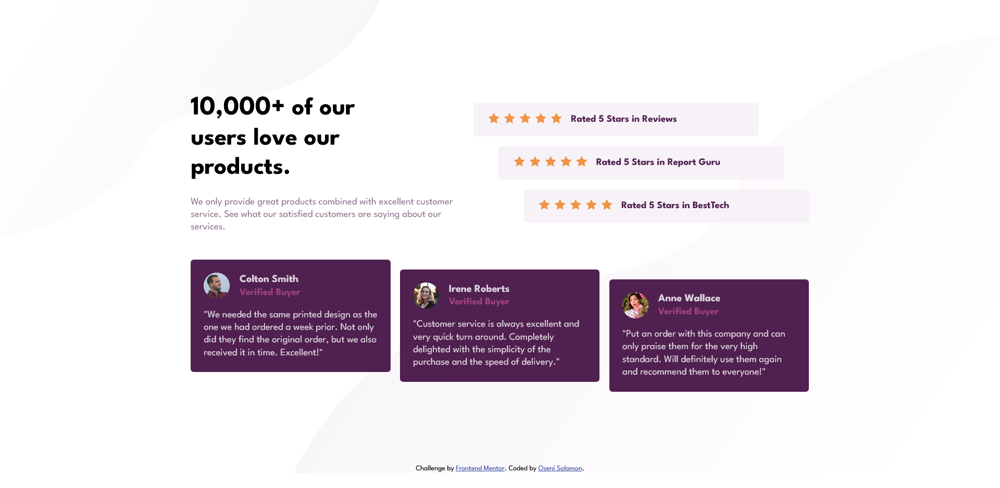

# Frontend Mentor - Social proof section solution

This is a solution to the [Social proof section challenge on Frontend Mentor](https://www.frontendmentor.io/challenges/social-proof-section-6e0qTv_bA). Frontend Mentor challenges help you improve your coding skills by building realistic projects. 

## Table of contents

- [Overview](#overview)
  - [The challenge](#the-challenge)
  - [Screenshot](#screenshot)
  - [Links](#links)
- [My process](#my-process)
  - [Built with](#built-with)
  - [What I learned](#what-i-learned)
  - [Useful resources](#useful-resources)
- [Author](#author)

## Overview

### The challenge

Users should be able to:

- View the optimal layout for the section depending on their device's screen size

### Screenshot

### Links

- Solution URL: [solution URL](https://github.com/SoloLere/social-proof.git)
- Live Site URL: [live site URL](https://sololere.github.io/social-proof/)

## My process

### Built with

- Semantic HTML5 markup
- CSS custom properties
- Flexbox
- Mobile-first workflow

### What I learned

- Had to go do a quick flexbox box course for the project

- width and flex-shrink are really good combos because shrink direspects width until width is reached and shrink now gets disrespected.

-when going from flex column to row, one item will always try to smotch the rest, the best way to overcome this is by giving the flex items a defined width.

-flex basis behaves like width in row layout and height in column layout. It looks at the main axis of the parent

- Flex sets the outside to a display of block and flexes the inside. 

- Display: inline-flex, mess around with it a bit. THis property sets the container as an inline element

### Useful resources

- [resource 1](https://courses.kevinpowell.co/conquering-responsive-layouts) - This  Kevin's course on flexbos really helped me discover the awsome power of flex. I really enjoyed learing about flex and will use it going forward.

## Author

- Mail - [Oseni Solomon](jnrolalere@gmail.com)
- Frontend Mentor - [@myusername](https://www.frontendmentor.io/profile/@SoloLere)
